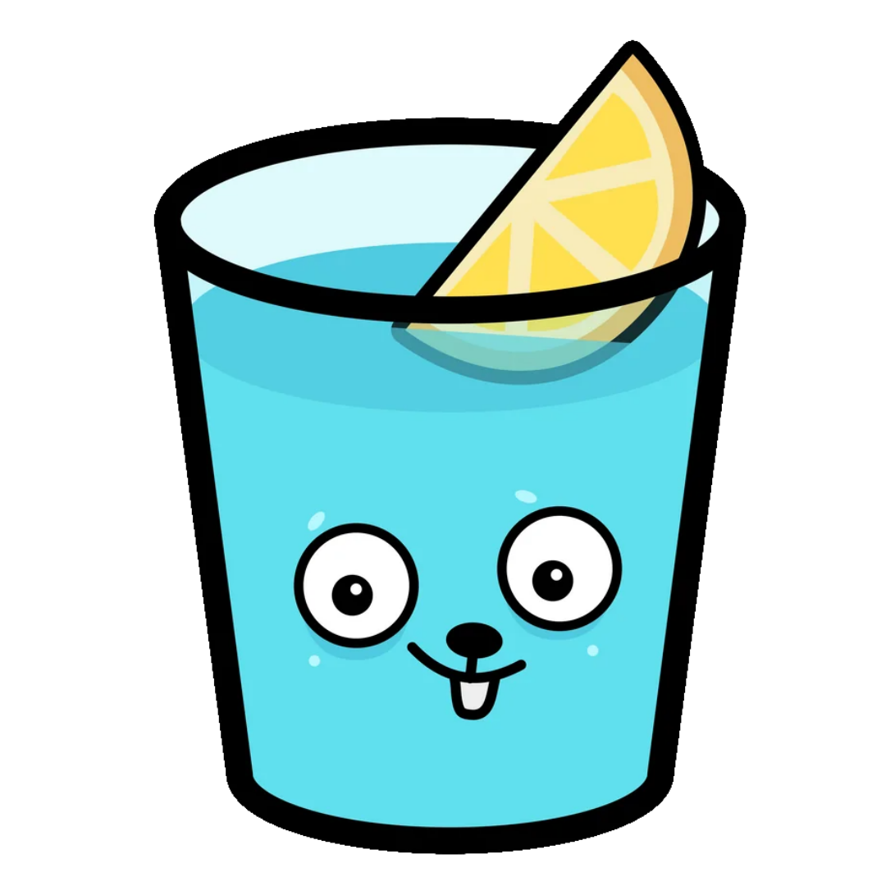

<!-- 
    Logo image generated by Bing IA: https://www.bing.com/images/create/
-->
## Todo Golang

<!-- 
    icons by: https://simpleicons.org
-->
   

 

<!--  -->

---

### Sobre:
Todo list simples para estudo de Golang.